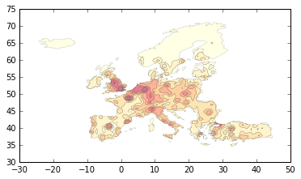

smoomapy
========

Make smoothed maps in your python environnement
~~~~~~~~~~~~~~~~~~~~~~~~~~~~~~~~~~~~~~~~~~~~~~~

|Build Status| |Version| |Coveralls|

More or less a python port of *Stewart method* from R SpatialPositon
package (https://github.com/Groupe-ElementR/SpatialPosition/).  

Allow to set a desired number of class and choose discretization method or
directly set some custom breaks values.  

Input/output can be a path to a geographic layer (GeoJSON, shp, etc.) or a GeoDataFrame.

Requires:
^^^^^^^^^

-  Numpy
-  GeoPandas
-  SciPy
-  Matplotlib

Documentation on the method :
~~~~~~~~~~~~~~~~~~~~~~~~~~~~~

Please refer to https://github.com/Groupe-ElementR/SpatialPosition/
documentation.

Usage example:
~~~~~~~~~~~~~~

One-shot functionnality
^^^^^^^^^^^^^^^^^^^^^^^

.. code:: python

    >>> result = quick_stewart('nuts3_data.geojson',
                               "pop1999",
                               span=65000,
                               beta=3,
                               resolution=48000,
                               mask='nuts3_data.geojson',
                               nb_class=10,
                               user_defined_breaks=None,
                               output="geojson")

Object-oriented API, allowing to easily redraw contours with new breaks values or new interpolation functionnality
^^^^^^^^^^^^^^^^^^^^^^^^^^^^^^^^^^^^^^^^^^^^^^^^^^^^^^^^^^^^^^^^^^^^^^^^^^^^^^^^^^^^^^^^^^^^^^^^^^^^^^^^^^^^^^^^^^

.. code:: python

    >>> StePot = SmoothStewart('nuts3_data.geojson', "pop1999",
                           span=65000, beta=3,
                           resolution=60000,
                           mask='nuts3_data.geojson')
    >>> res = StePot.render(nb_class=8, func_grid="matplotlib",
                            disc_func="jenks", output="GeoDataFrame")
    >>> res.plot(cmap="YlOrRd", linewidth=0.1)

The long part of the computation is done during the initialization of
``SmoothStewart`` instance (i.e. actually computing potentials). Some
convenience methods allows to tweak and re-export the few last steps :

**Allow to quickly redraw polygons with a new classification method (or
with new interpolation functionnality)**
Availables classification
methods are: "equal\_interval", "prog\_geom", "jenks", "percentiles" and
"head-tail-breaks"

.. code:: python

    >>> StePot.change_interp_grid_shape((164, 112))

    >>> res = StePot.render(nb_class=6, func_grid="scipy",
                            disc_func="percentiles", output="GeoDataFrame")

**Allow to set custom break values (highly recommended after a first
rendering or having take a look at the distibution):**

.. code:: python

    >>> my_breaks = [0, 1697631, 3395263, 5092894, 6790526,
                     8488157, 10185789, 11883420, 13581052]

    >>> res = StePot.render(nb_class=6, user_defined_breaks=my_breaks,
                            output="GeoDataFrame")

Installation:
~~~~~~~~~~~~~

From PyPI :
^^^^^^^^^^^

.. code:: shell

    $ pip install smoomapy

From github :
^^^^^^^^^^^^^

.. code:: shell

    $ git clone http://github.com/mthh/smoomapy.git
    $ cd smoomapy/
    $ python setup.py install

.. |Build Status| image:: https://travis-ci.org/mthh/smoomapy.svg?branch=master
   :target: https://travis-ci.org/mthh/smoomapy

.. |Version| image:: https://img.shields.io/pypi/v/smoomapy.svg
   :target: https://pypi.python.org/pypi/smoomapy

.. |Coveralls| image:: https://coveralls.io/repos/github/mthh/smoomapy/badge.svg?branch=dev
   :target: https://coveralls.io/github/mthh/smoomapy?branch=dev

